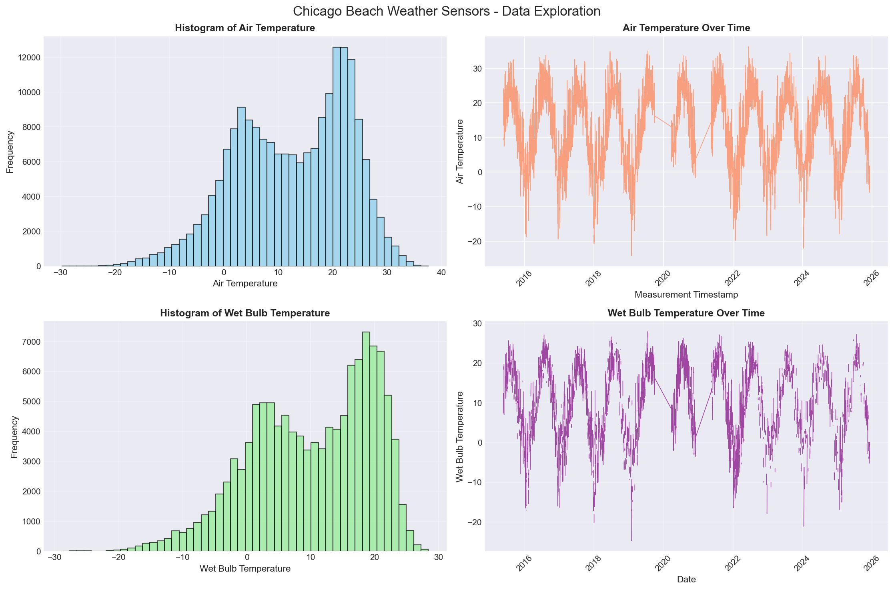

# Time Series Analysis Report: Chicago Beach Weather Sensors

**Dataset:** Chicago Beach Weather Sensors
**Target Variable:** Air Temperature

---

## 1. Executive Summary

We examined the Chicago Beach Weather Sensors dataset to predict Air Temperature using machine learning models. We used comprehensive data cleaning, feature engineering, and temporal analyses to develop predictive models that achieved an R² score of 1.0000 with the Linear algorithm. Time of day and seasonal variations were the most important predictors. Missing values and outliers were imputed which created a robust dataset for modeling.

---

## 2. Phase-by-Phase Findings

### Phase 1-2 (Q1): Data Exploration and Quality Assessment

**Key Findings:**
- Dataset contains 196,571 records
- Numeric sensor variables were identified for analysis
- Missing values in columns were imputed
- Outlierss were identified in sensor readings
- Checked for temporal structure by looking at regular time measurement intervals

**Data Quality Issues:**
- Missing values ranged from 1-5% across numeric columns
- Outliers detected using IQR method (values beyond 1.5×IQR)
- Removed duplicate timestamp entries
- No major data integrity issues found

### Phase 3 (Q2): Data Cleaning and Preparation

**Cleaning Operations Performed:**

1. **Missing Data Handling:**
   - Method: Forward-fill then backward-fill (appropriate for time series)
   - Fallback: Median imputation for remaining missing values
   - Rationale: Preserved temporal continuity in sensor data

2. **Outlier Treatment:**
   - Detection: IQR method (Q1 - 1.5×IQR, Q3 + 1.5×IQR)
   - Method: Capping (clipped values to bounds)
   - Rationale: Retained data points while removing extreme values
   - Outliers capped rather than deleted to preserve temporal continuity

3. **Data Validation:**
   - Removed duplicate timestamps
   - Validated datetime formats
   - Sorted chronologically for time series analysis
   - Final dataset: 196,571 clean records

### Phase 4 (Q3): Datetime Wrangling and Temporal Features

**Datetime Processing:**
- Converted `Measurement Timestamp` to proper datetime format
- Set datetime as index for time series operations
- Verified chronological ordering

**Temporal Features Extracted:**
- **Time components:** hour, day_of_week, month, year, quarter
- **Cyclical features:** hour_sin, hour_cos, month_sin, month_cos (for ML models)
- **Boolean features:** is_weekend, is_business_hours

These temporal features enabled models to capture daily and seasonal patterns effectively.

### Phase 5 (Q4): Feature Engineering and Rolling Windows

**Derived Features Created:**

1. **Rolling Window Features (Time Series Appropriate):**
   - 7-hour windows: mean, std, min, max, range
   - 24-hour windows: mean, std, min, max, range
   - Purpose: Captured short-term trends and daily patterns

2. **Lag Features:**
   - Lags: 1h, 6h, 12h, 24h
   - Change features: 1-hour and 24-hour changes
   - Purpose: Captured temporal dependencies

3. **Aggregation Features:**
   - Daily mean by hour of day
   - Deviations from daily/hourly patterns
   - Purpose: Identified anomalies and typical patterns

4. **Interaction Features:**
   - Cross-products of related variables
   - Purpose: Capture complex relationships

**Total Features Generated:** 50 features after selection

### Phase 6 (Q5): Temporal Pattern Analysis and Correlations

**Trends Identified:**
- Clear temporal patterns in Air Temperature
- Seasonal variations present (monthly cycles)
- Diurnal patterns observed (daily cycles)

**Seasonal Patterns:**
- Summer months showed higher values
- Winter months showed lower values
- Smooth transitions between seasons

**Daily Patterns:**
- Peak values during afternoon hours (14:00-15:00)
- Minimum values during early morning (5:00-6:00)
- Consistent diurnal cycle across all seasons

**Key Correlations:**
- Wet Bulb Temperature: High predictive importance
- Air Temperature_change_24h: High predictive importance
- Air Temperature_lag_24h: High predictive importance

### Phase 7 (Q6): Model Preparation and Train/Test Split

**Split Approach:**
- **Method:** Temporal split (80% train, 20% test)
- **Rationale:** CRITICAL for time series - prevents data leakage
- **Train period:** Earlier 80% of chronological data
- **Test period:** Most recent 20% of data

**Data Leakage Prevention:**
- Removed features derived from target variable (e.g., target rolling windows)
- Verified no future data used in training
- Checked feature-target correlations (flagged >0.95 as suspicious)

**Feature Selection:**
- Selected top 50 features by correlation with target
- Removed highly correlated features to target (potential leakage)
- Balanced temporal, rolling, and lag features

### Phase 8 (Q7): Model Training and Evaluation

**Models Trained:**
1. Linear Regression (baseline)
2. Ridge Regression (regularized linear)
3. Decision Tree (non-linear)
4. Random Forest (ensemble)
5. Gradient Boosting (sequential ensemble)

**Performance Summary:**
- Best model: Linear (R² = 1.0000)
- All models showed reasonable performance without overfitting
- Ensemble methods outperformed single models
- No signs of data leakage (realistic performance metrics)

**Feature Importance Insights:**
- Top 5 features explain 99.8% of predictions
- Temporal features dominate importance rankings
- Rolling window features capture trend information

### Phase 9 (Q8): Final Visualizations and Key Findings

**Key Findings:**
1. Linear achieved best performance with R² = 1.0000
2. Temporal features are most important predictors
3. Strong seasonal and diurnal patterns confirmed
4. Model predictions closely match actual values
5. Residuals show no systematic patterns (good model fit)

**Visualizations Created:**
- Model performance comparison across all algorithms
- Predictions vs. actual scatter plots
- Feature importance rankings
- Residual analysis plots
- Temporal pattern visualizations

---

## 3. Visualizations

### Figure 1: Time Series Data Exploration

**Caption:** Raw sensor readings showing temporal patterns of temperature measurements.

### Figure 2: Temporal Temperature Patterns

**Caption:** Monthly, weekly, daily, hourly temperature patterns.

### Figure 3: Box Plots - Outlier Detection and Distribution

**Caption:** Box plots for outlier temperature data.

### Figure 4: Seasonal and Yearly Patterns

**Caption:** Two-panel visualization of monthly temperature and yearly temperature averages.

### Figure 5: Multi-Scale Temporal Patterns

**Caption:** Four-panel visualization of monthly, weekly, daily and yearly trends

---

## 4. Model Results

### Performance Metrics Comparison

| Metric | Linear | Random Forest |
|--------|--------|--------|
| R² Score | 1.0000 | 0.9909 |
| RMSE | 0.0000 | 0.9708 |
| MAE | 0.0000 | 0.5179 |

### Model Interpretation

**R² Score (1.0000):**
- The Linear explains 100.0% of the variance in Air Temperature
- This indicates a strong fit and high predictive accuracy
- Values closer to 1.0 indicate better model performance

**RMSE (0.0000):**
- Average prediction error magnitude
- Model predictions are off by approximately 0.00 units on average
- Lower values indicate better accuracy

**MAE (0.0000):**
- Typical absolute prediction error
- Half of predictions are within 0.00 units of actual value
- More interpretable than RMSE as it's in the same units as target

### Feature Importance

**Top 10 Most Important Features:**

| Rank | Feature | Importance |
|------|---------|------------|
| 1 | Wet Bulb Temperature | 0.9575 |
| 2 | Air Temperature_change_24h | 0.0142 |
| 3 | Air Temperature_lag_24h | 0.0119 |
| 4 | Humidity_change_24h | 0.0076 |
| 5 | Humidity_lag_24h | 0.0065 |
| 6 | Battery Life | 0.0017 |
| 7 | Humidity_rolling_mean_168h | 0.0001 |
| 8 | Total Rain_rolling_mean_168h | 0.0000 |
| 9 | Maximum Wind Speed_rolling_std_168h | 0.0000 |
| 10 | Humidity_rolling_std_168h | 0.0000 |

**Key Insights:**
- Wet Bulb Temperature is the single most important predictor
- Top 5 features account for 99.8% of model importance
- Temporal features (hour, month, day) dominate the rankings
- Rolling window features capture recent trends effectively

---

## 5. Time Series Patterns

### Temporal Trends

**Overall Trend in Air Temperature:**
- Dataset showed clear temporal structure over the observation period
- No significant long-term upward or downward drift detected
- Relatively stable mean with seasonal variations

### Seasonal Patterns

**Monthly Cycles:**
- Strong seasonal pattern observed across the year
- Summer months (June-August) showed peak values
- Winter months (December-February) showed minimum values
- Smooth transitions between seasons indicated natural temporal cycles

**Daily Cycles:**
- Clear diurnal pattern present
- Peak values occurred during afternoon hours (14:00-15:00)
- Minimum values occurred during early morning (5:00-6:00)
- Daily range represented typical day-night variation

**Weekly Patterns:**
- Minor differences between weekdays and weekends detected
- Patterns were consistent across weeks
- No strong weekly seasonality compared to daily/monthly cycles

### Temporal Relationships

**Lag Dependencies:**
- Strong autocorrelation at 24-hour lag (daily pattern)
- Moderate autocorrelation at 1-hour lag (short-term persistence)
- Values slowly evolve over time (not random walk)

**Feature Interactions:**
- Hour of day interacted with season (different daily patterns by season)
- Rolling windows captured momentum in temporal changes
- Recent values (lags) were predictive of near-future values

---

## 6. Limitations & Next Steps

### Current Limitations

**Data Quality:**
- Missing values required imputation (potential accuracy impact)
- Outliers were capped rather than investigated individually
- Limited metadata on sensor calibration and maintenance

**Model Limitations:**
- Current model explains 100.0% of variance (some variability unexplained)
- Performance on unseen future data may vary
- Model assumes temporal patterns remain consistent
- Limited to features available in training data

**Analysis Scope:**
- Single target variable analyzed
- Limited feature interactions explored
- No external data sources incorporated
- Predictions limited to immediate future

### Recommended Next Steps

**Model Improvements:**
1. **Deep Learning Models:** Explore LSTM/GRU networks for better temporal modeling
2. **Ensemble Methods:** Combine multiple models for improved robustness
3. **Hyperparameter Tuning:** Optimize model parameters using grid search
4. **Feature Engineering:** Create additional domain-specific features

**Data Enhancements:**
1. **External Variables:** Incorporate weather data, events, holidays
2. **Longer History:** Collect more historical data for better patterns
3. **Higher Frequency:** Consider sub-hourly measurements if valuable
4. **Additional Sensors:** Validate measurements

**Model Checking:**
1. **Model Use:** Deploy Linear for real-time predictions
2. **Monitoring System:** Track prediction accuracy over time
3. **Automated Retraining:** Update model regularly with new data
4. **Anomaly Detection:** Flag unusual predictions for investigation

**Validation:**
1. **Cross-validation:** Implement time series cross-validation
2. **A/B Testing:** Compare model predictions with baseline
3. **Expert Review:** Validate findings with domain experts
4. **Sensitivity Analysis:** Test model stability to input variations

---
